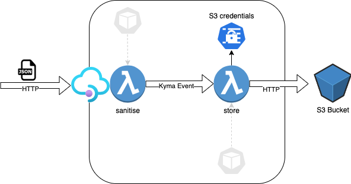

# kyma-serverless-community-hour

# Use case


# Explore 

Explore at [kyma-dashboard](https://console.c-31cabdf.kyma.ondemand.com/)

### Draft the code

```js
const { v4: uuidv4 } = require('uuid');
const string = require("string-sanitizer");
module.exports = {
    main: function (event, context) {

        let sanitisedData = sanitise(event.data);

        const eventOut = buildEventPayload(sanitisedData, event);
        event.publishCloudEvent(eventOut).then(response => {
            console.log(`Payload pushed`, response.data);
        }).catch(err => {
            console.error("Could not send event",err);
        })
        return "OK"
    }
}
let sanitise = (data)=>{
    for (var key in data) {
        if (data.hasOwnProperty(key)) {
            let sanitized = string.sanitize(data[key])
            console.log(`sanitizing ${data[key]} -> ${sanitized}`);
            data[key]=sanitized
        }
    }
    console.log(data);
    return data;
}

let buildEventPayload = (data, event)=>{
    
    // const eventSource = "kyma"
    // const eventType = "sap.kyma.custom.acme.payload.sanitised.v1"
    // const eventSpecVersion = "1.0"    

    //TODO Read from ENVS!
    const eventType = process.env['eventtype']
    const eventSource = process.env['eventsource']
    const eventSpecVersion = process.env['eventspecversion']
    var eventPayload=event.buildResponseCloudEvent(uuidv4(),eventType,data);
    eventPayload.source=eventSource
    eventPayload.specversion=eventSpecVersion;
    return eventPayload;
}
```

```json
{
  "name": "sanitize-fn",
  "version": "0.0.1",
  "dependencies": {
    "uuidv4": "6.2.12",
    "string-sanitizer": "2.0.2"
  }
}
```

### Test
```bash
export url=data-in.c-31cabdf.kyma.ondemand.com
curl  -H "Content-Type: application/json"   -X POST -d '{"FirstName":"J@#$%ohn!", "LastName":"Do@@*&e"}' "https://$url/"
```

# Use Kyma CLI

## Fetch what you got already

```bash
mkdir src
cd src
mkdir sanitize-fn
cd sanitize-fn
kyma sync function sanitize-fn
code .
```

### Delete and re-create

```bash
k delete functions --all
kyma apply function
```

## Init new function

```bash
cd src
mkdir store-fn
cd store-fn
kyma init function --name store-fn --vscode
code .
```

### Run locally with Hot-Deployment/Debug

```bash
kyma run function --hot-deploy  

curl localhost:8080
```

### IDE Autocompletion

Subscription to event
```yaml
subscriptions:
    - name: store-fn
      protocol: ""
      filter:
        filters:
            - eventSource:
                property: source
                type: exact
                value: ""
              eventType:
                property: type
                type: exact
                value: sap.kyma.custom.acme.payload.sanitised.v1
```
S3 storage ENVs

apply secret first : `kubectl apply -k ./k8s-resources/base`

```yaml
env:
  - name: S3_BUCKET
    valueFrom:
      secretKeyRef:
        name: s3-storage
        key: S3_BUCKET
  - name: S3_ENDPOINT
    valueFrom:
      secretKeyRef:
        name: s3-storage
        key: S3_ENDPOINT
  - name: S3_ACCESSKEY_ID
    valueFrom:
      secretKeyRef:
        name: s3-storage
        key: S3_ACCESSKEY_ID
  - name: S3_SECRET
    valueFrom:
      secretKeyRef:
        name: s3-storage
        key: S3_SECRET
```
## Apply final version of store-fn

```bash
git checkout store-function-final

kyma apply function
```
